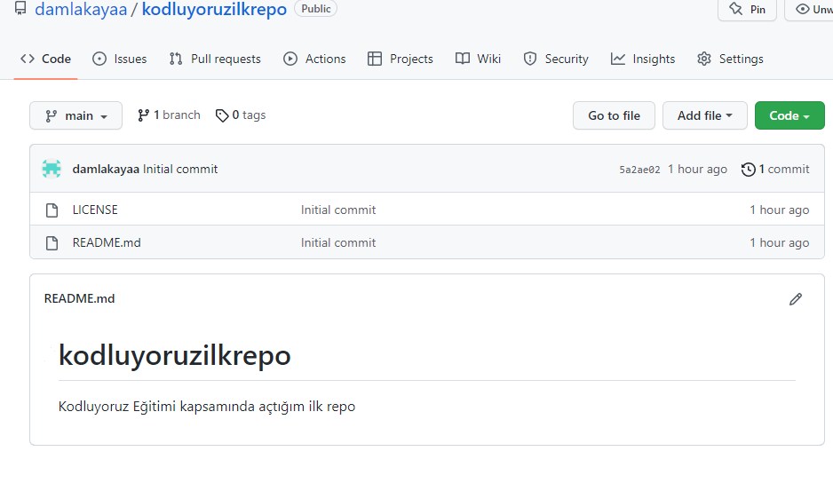

# kodluyoruzilkrepo
Kodluyoruz Eğitimi kapsamında açtığım ilk repo
# Installation
Öncelikle projeyi clonlayın. (Buraya sizin reponuzdan aldığınız link gelecek)

git clone https://github.com/damlakayaa/kodluyoruzilkrepo.git

# Usage

Projeyi cloneladıktan sonra Visual Studio Code programında açınız.

Linux için:

`cd kodluyoruzilkrepo
code .`

# Contributing

Pull requestler kabul edilir. Büyük değişiklikler için, lütfen önce neyi değiştirmek istediğinizi tartışmak için bir konu açınız.

# License

[MIT](https://choosealicense.com/licenses/mit/)

